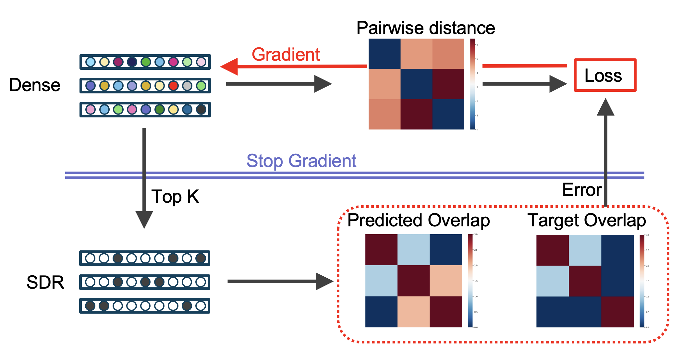
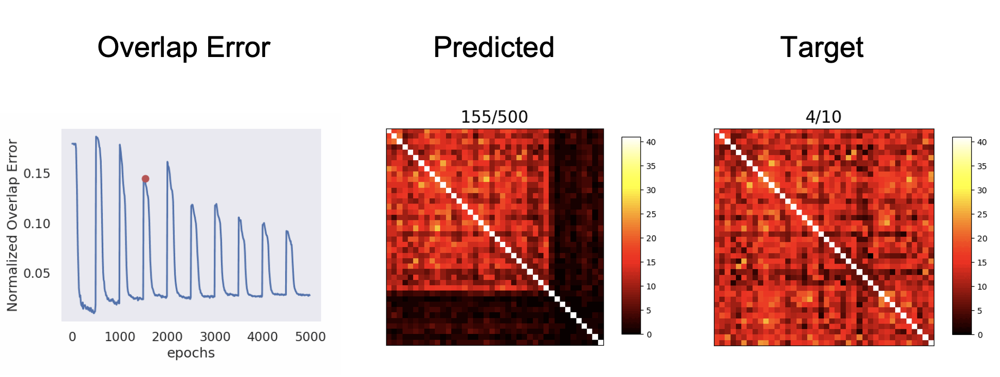
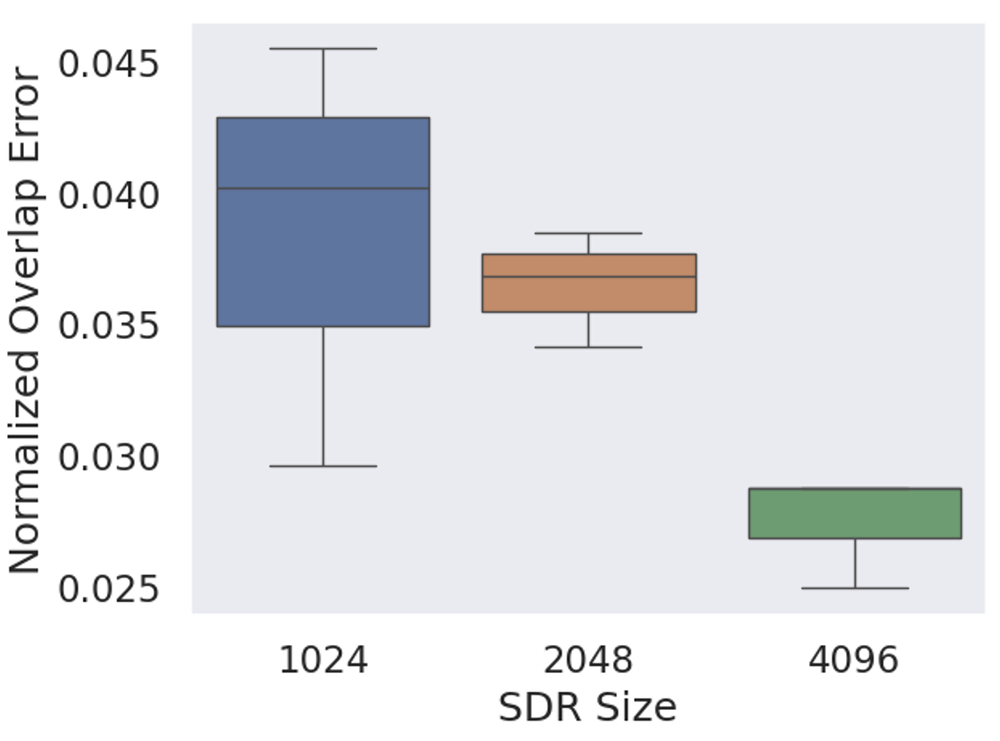
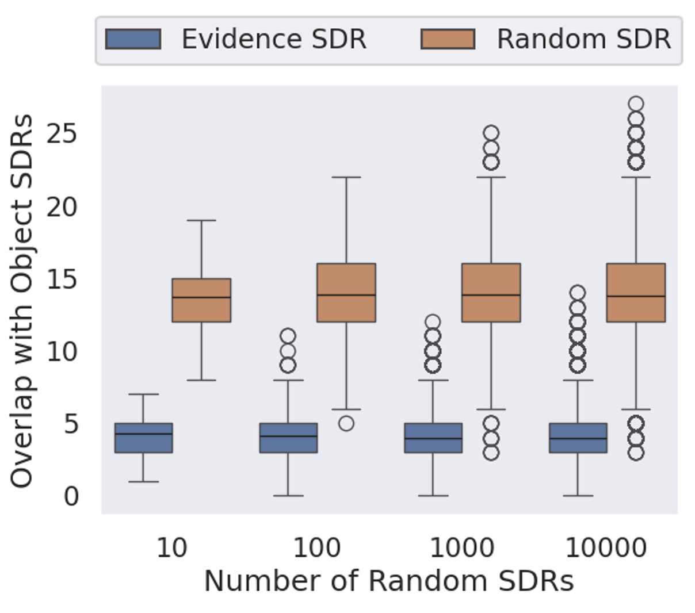
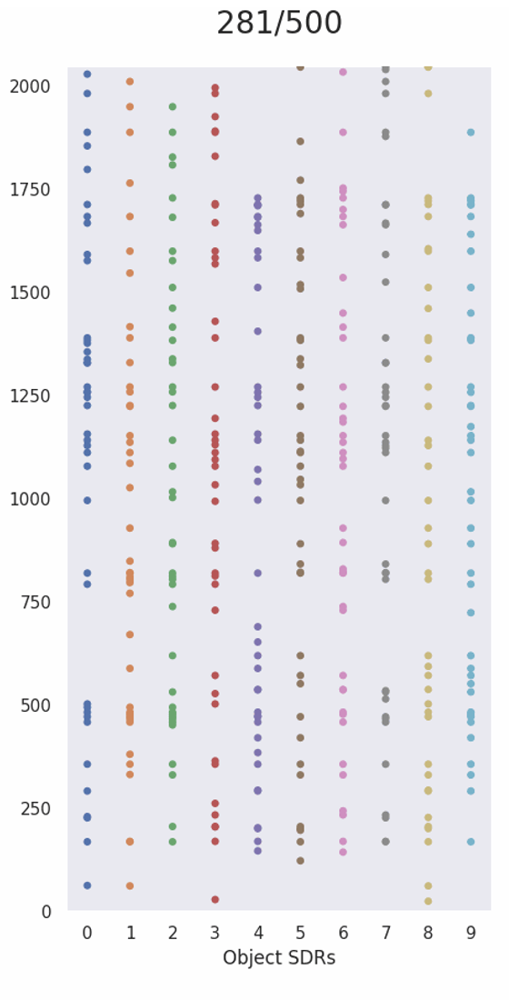

# Evidence SDR for Synthetic Data
This project implements SDR encoding based on similarity computed from synthetic data.

This is only to be used as a proof of concept and is not meant to be used as part of the core Monty codebase.


<div align="center">
  
</div>

---

## Overview

In Monty, the learning modules communicate object Ids that do not convey similarity or much information about the learned object in relation to other objects.
This project is a PoC for creating an SDR of each object in memory by defining target pairwise overlap between the objects.
The approach initializes random dense representations at first, then binarizes these representation (into SDRs) using a topK function, where K here is the number of active bits defining the sparsity.
We calculate the overlap between the SDRs and compare it to the target overlap. The overlap error guides the loss function to reduce or increase the L2 distance between the dense representations.
Closer dense representation implies more overlap in the SDR space, and vice versa.

**Note**: Note that the overlap_error is only used to weight the distance_matrix loss, and gradients do not flow through the sparse overlap calculations. 
The magnitude of the overlap error controls the strength of moving dense representations. 
Also the sign of the overlap error controls whether the representations will be moving towards or away from each other.

**Note**: We do not move the actual dense representation towards an SDR, but instead we modify their values such that when binarized, they output SDRs with the desirable overlaps.

This document explains how to define a model configuration, train and log the results, and then visualize the results.

### Configs

The configs can be defined in the configs directory, the configurations for each experiment are saved in a `.yaml` file.

Some configurations to be defined in the file are:

- 'num_objects': (List) : The number of objects to be used. It is defined as a list to allow for adding objects in a streaming manner during training. For example [10, 10], trains 10 objects then adds another 10 objects.
- 'sdr_length': (Int) : The size of the SDR to be used.
- 'sdr_on_bits': (Int) : The number of active bits to define the sparsity of the SDR.
- 'sample_size': (Int) : How many objects per minibatch are considered for every gradient step. If "0", uses all available objects (num_objects).
- 'num_epochs': (Int) : Number of epochs to train per step of objects added. Total number of epochs will be num_epochs\*len(num_objects).
- 'log_every': (Int) : Logging frequency in minibatches/iterations
- 'lr': (Float): Learning rate of the optimizer
- 'evidence_range': (List) : Input range for evidence linear mapping to similarity. If [0, 0] is used the min and max of evidences will be used.
- 'overlap_range': (List) : Output range for evidence linear mapping to similarity. Use [0, sdr_on_bits].
- 'log_pth': (Bool) : Flag to log results to pth file. Should always be turned on unless debugging.

An example config file is provided [here](./configs/exp_001.yaml)

**Note**: The choice of evidence_range and overlap_range can always be set to [0,0] and [0,sdr_on_bits] respectively.
We provide the option to set a fixed input range (i.e., evidence_range) for the use case of knowing the range of evidences beforehand (e.g., [0, 100]).
If we know the expected input range and use it, the target overlaps will not change due to renormalization when adding new objects.
We can also choose a minimum overlap other than zero in the overlap_range if needed. 
This can useful in the future if we do more intelligent mapping based on density of points and exclude outliers.

### Training

To train a model run the training script and pass the configuration file path to the script. An output log directory and seed can be defined as well.
Below are the script arguments:

- '--config', '-i': Path to the configuration file. For example `configs/exp_001.yaml`
- '--log', '-o': Path to the log directory. Will be created if not existing. For example `./log`.
- '--seed', '-s': Seed value. For example `0`

An example command to train the model is

```bash
python train.py --config configs/exp_001.yaml
```

Multiple training scripts can be run in sequence as shown in the bash script [here](./run.sh)

### Visualization

We provide multiple visualization scripts under the visualization directory.

#### Heatmaps and Line-Dot Animations

<div align="center">
  
</div>


To generate gifs for the target overlap heatmaps and output overlap heatmaps, as well as visualizations of the overlap error with time, use the following script:

```bash
python visualizations/process_logs.py -p "logs/exp_001/seed_000/pth"
```

Use the `-p` argument to pass the path of the pth directory of the specific experiment you wish to visualize. The visualizations will be saved in the same pth directory.

You can also pass a globbing pattern with the * wildcard to process multiple experiments as shown below:

```bash
python visualizations/process_logs.py -p "logs/exp_*/seed_*/pth"
```

#### Comparing Experiments (Box plot)

<div align="center">
  
</div>


To compare experiments using box plots, please refer to the file `visualizations/plot.py` and `visualizations/plot_compare.py`. An example command is provided in each script.

#### Validating SDR Overlap Properties (Box plot)

<div align="center">
  
</div>


To validate the SDR properties of the trained SDRs, please refer to the file `visualizations/validate_sdr.py`. Example command is provided in the script.

#### Visualize SDR Change During Training (Strip plot)

To visualize SDR bits on a strip plot over time, refer to the file `visualizations/validate_sdr_change.py`. Example command is provided in the script.

<div align="center">
  
</div>
