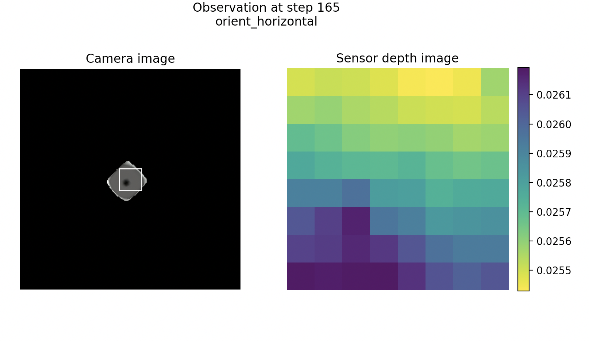
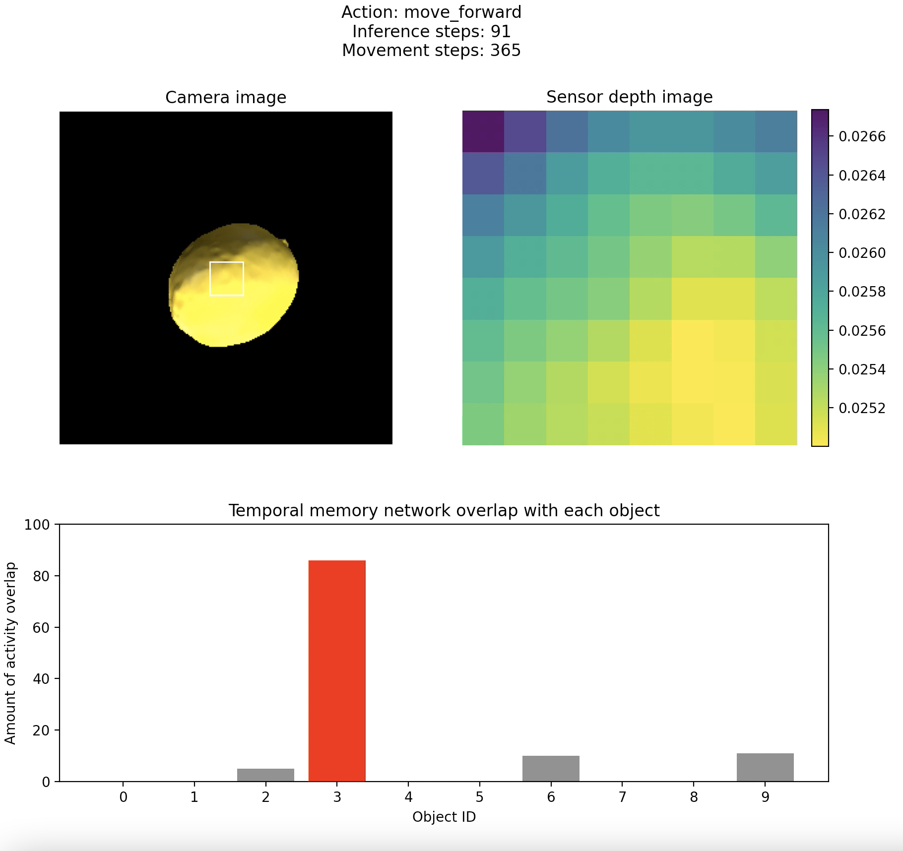

# Tactile temporal memory
This folder contains all that's needed to run a tactile temporal memory experiment. Let's start by running a demo experiment. Start by navigating to the projects/tactile_temporal_memory folder in your terminal. The demo then involves the following steps:

## Run a DataCollectionExperiment
**This uses the touch-sensor agent to generate a set of observations.** The agent navigates to the object and moves along it, collecting observations (currently, gaussian curvatures and 3D locations) and then saving these to an observations.pt file (currently saved to *"~/tbp/results/monty/projects/feature_eval_runs/logs/explore_touch/observations0.pt"*). Before saving all these data, let's check out what the touch exploration looks like in an online display.
```
python run.py -e explore_touch_test
```

If everything looks right, let's let this run for 10k steps without displaying the data online (much faster).
```
python run.py -e explore_touch
```
If you want to change the parameters of this experiment, the configs are located in .config/config_explore.py. For example, if you want this to run even faster, you can change the number of steps in the config: ```max_train_steps = 2000```

## Process the curvature and location data you just collected
Now we want to **normalize the data** to a range of 0-100, save these data and save the (automatically computed) parameters used to normalize the data. See projects/temporal_memory/README.md for more info on running these commands.
```
python process_data.py
```
Next let's **turn the location data into SDRs**. Working (default) parameters: r=2 (hash radius), w=18 (# of non-zero elements), n=2048 (# of total elements), d=0 (start index of objects), d=10 (end index of objects). To change the parameters you would add e.g. ```-r 2 -w 18 -n 2048 -d1 0 -d2 10``` to the end of the command
```
python coordinate_encoder.py
```
Now **turn the curvature data into SDRs**. Working parameters are default: r=3 (hash radius), w=7 (# of non-zero elements), n=1024 (# of total elements), d=0 (start index of objects), d=10 (end index of objects). To change the parameters you would add e.g. ```-r 3 -w 7 -n 1024 -d1 0 -d2 10``` to the end of the command
```
python curvature_encoder.py
```
Finally, **cluster the observations into N key points** that we will use to train the temporal memory network. The rest of the points will be discarded. Working parameters: n=100 (# of key points), coord=True (cluster by location), curve=True (also cluster by curvature). To change the parameters you would add e.g. ```-n 100 -coord True -curve False```
```
python cluster.py
```
## Recognize the objects through touch
**Collect a new set of observations and track which object is perceived online.** This part of the experiment is just one command but consists of several substeps:
- Train the temporal memory network, using the points extracted from the clustering step
- Orient 180 degrees to the "other side" of the object to ensure we are not getting the exact same trajectory as in the training set
- Navigate around the object using touch
- Every e points (working: every_other = 4), take the location and gaussian curvature. Normalize these data using the saved parameters. Input them to the trained temporal memory network. Record the activity overlap with each candidate object. 
    - Note, one "point" occurs once every 4 action steps. This is because orienting to the surface take 3 actions (move_forward, orient_horizontal, orient_vertical, move_tangentially; see projects/touch_sensor/README.md). Thus for every_other=4, we are testing the model every 4 movement steps, *which means every 16 action steps*.
- TODO: Terminate evaluation once a threshold overlap and ratio to the 2nd place object are met
- Finally, report which object was selected in the terminal, save the object overlaps to *"~/tbp/results/monty/projects/feature_eval_runs/logs/tactile_TM/overlap0.pt"* and the object recognition summary figure to the same folder as *TactileTM_object0.png*

Before running the full experiment, let's make sure this looks right and we understand what's going on. Run a brief version of this experiment, with the online display on (show_sensor_output=True)

```
python run.py -e tactile_TM_test
```

If everything looks right, let's let this run for 1600 steps (since every_other=4, this is equivalent to 100 inference steps!) without displaying the data online (much faster).
```
python run.py -e tactile_TM
```
If you want to change the parameters of this experiment, the configs are located in .config/config_TM.py

## Example config change: doing it with 30 objects instead of 10
1. In .config/config_explore.py, set: ```object_names=get_object_names_by_idx(0, 30, object_list=SHUFFLED_YCB_OBJECTS_II)```
2. Run ```python run.py -e explore_touch```
3. Run ```python process_data.py -num_objects 30```
4. Run ```python coordinate_encoder.py -d2 30```
5. Run ```python curvature_encoder.py -d2 30```
6. Run ```python cluster.py```
7. In .config/config_TM.py, set: ```dataset_class=YCBMeshSDRDataset30``` and ```object_names=get_object_names_by_idx(0, 30, object_list=SHUFFLED_YCB_OBJECTS_II)```
8. Run ```python run.py -e tactile_TM```