# TBP Robot Lab

This folder contains instructions and code related to the tbp_robot_lab dataset and our
May 2025 robot hackathon.

For simplicity the configs are currently stored in `./experiments/configs/tbp_robot_lab.py`

## The Dataset

The TBP Robot Lab dataset contains 10 every day objects that were selected based on the availability to everyone in our intenational team and availability of existing mesh models. It contains the following objects:
- "numenta_mug": Coffee mug with Numenta logo. We also have mugs with the same dimensions but with the TBP logo which we can use to test generalization.
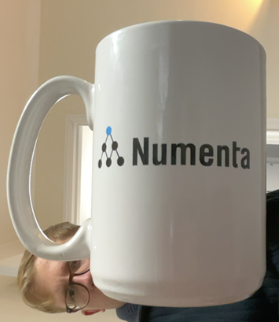
- "montys_brain": A stress ball in the shape of a brain with the Numenta logo on it. A logo-free version can be obtained here: https://www.etsy.com/uk/listing/1776034263/brain-stress-ball-gray-color-soft-foam
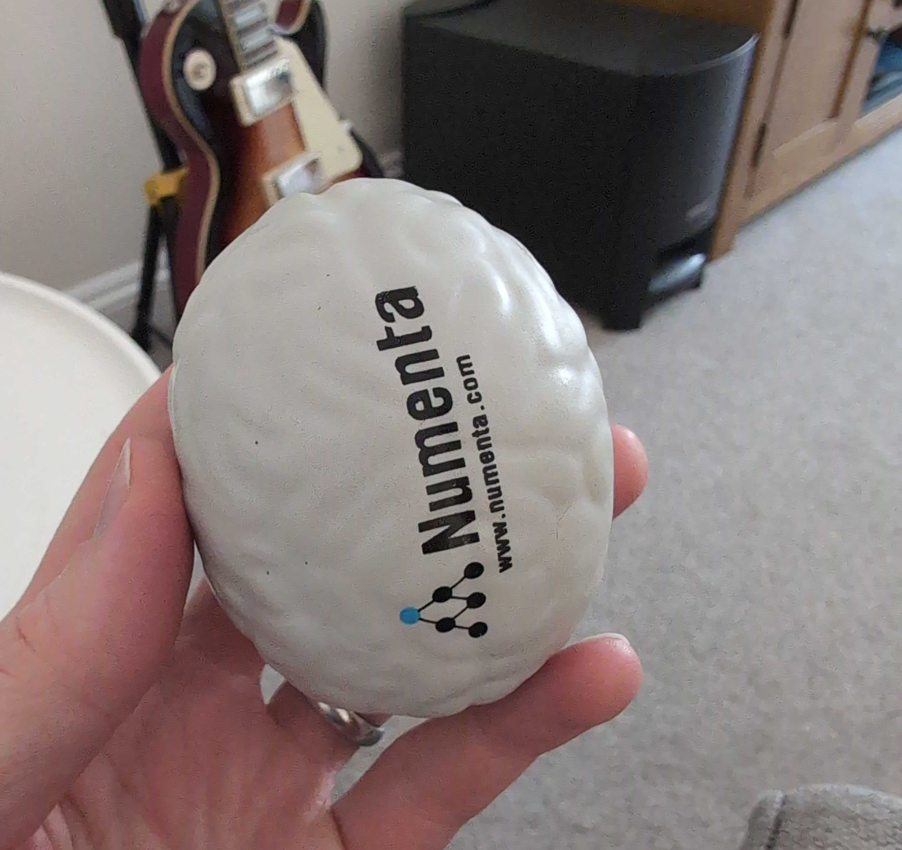
"montys_heart": Latex human heart (halloween prop). Can be obtained on Amazon. 
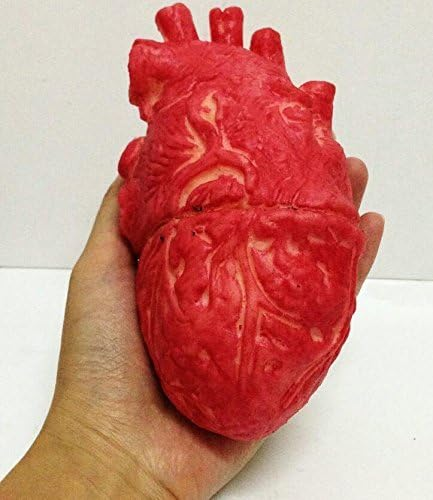
"ramen_pack": Instant ramen packet (“Buldak spicy chicken ramen”). Can be found in Asian supermarkets or online.
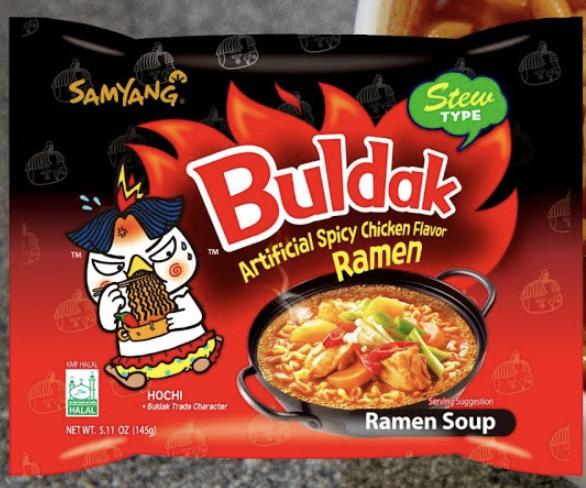
"hot_sauce": Psycho Juice hot sauce bottle. Can be found on Amazon.
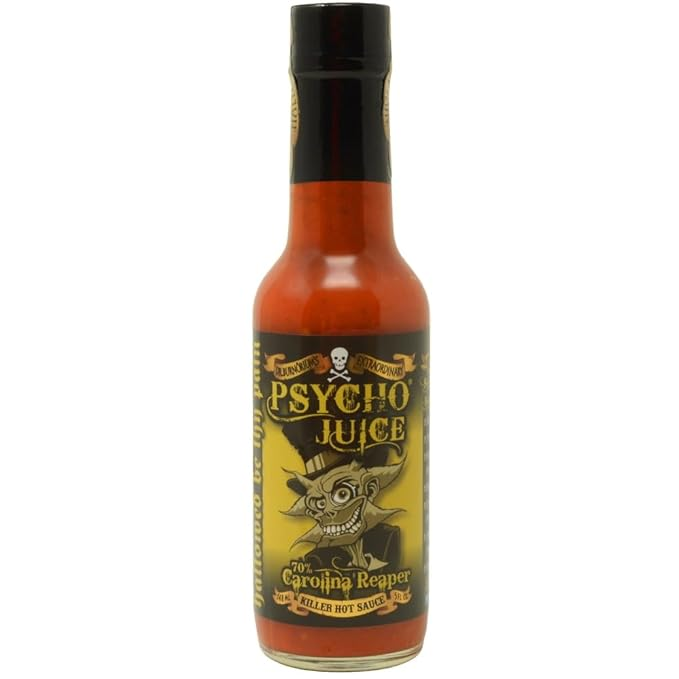
"harissa_oil": Rose Harissa oil jar. Can be found on Amazon.
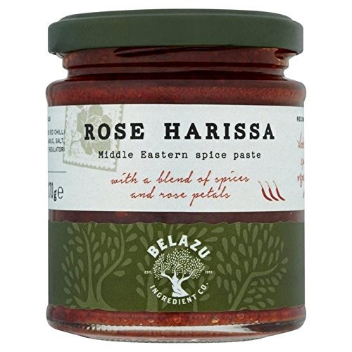
"tomato_soup_can": Cambell's Tomato Soup. Can be found in stores or online.
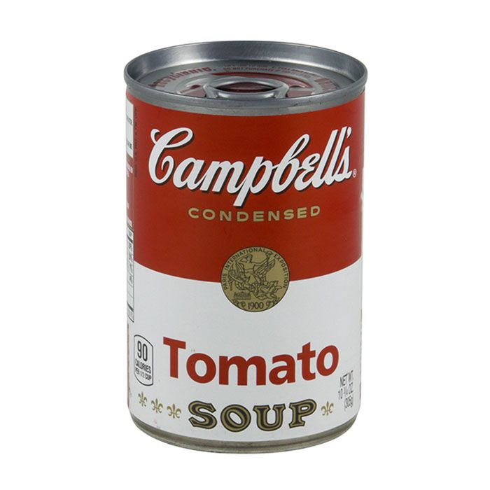
"mustard_bottle": "French's Classic Yellow" brand. Can be found in stores or online.
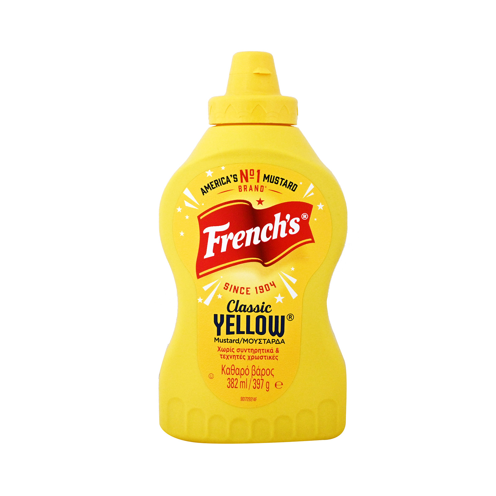
"tuna_fish_can": "StarKist Chunk Light" brand. Can be found in stores or online.
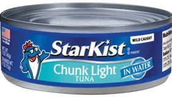
"potted_meat_can": SPAM can. Can be found in stores or online.
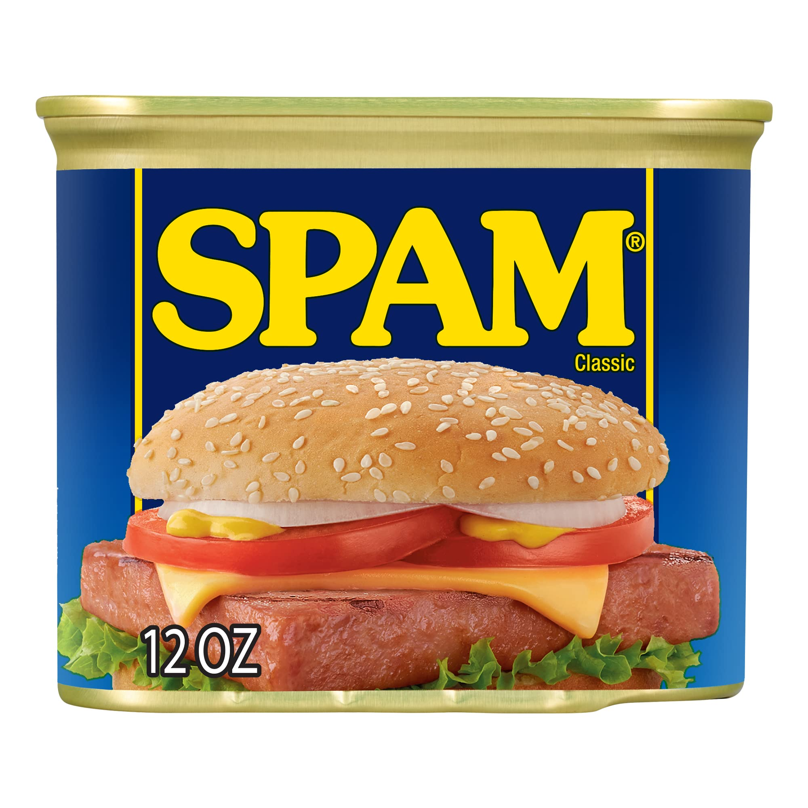

You can find the mesh dataset on our EFS file storage at `/mnt/results/TBP/data/tbp_robot_lab`.
TODO: make this publicly available.

## Pretained Models
You can either find pretrained models on our EFS file storage at `/mnt/results/TBP/monty/pretrained_models/pretrained_ycb_v10/surf_agent_1lm_tbp_robot_lab_obj` 
or generate them yourself by running `python ./experiments/run.py -e only_surf_agent_training_tbp_robot_lab`.

The resulting models should look like this:
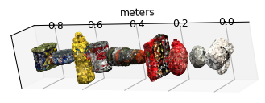

## Inference in Simulation
The main purpose of this dataset is to test object recognition in the real world using various robotics set ups. However, as baseline we also provide experiments and numbers for Monty's performance on this dataset in simulation.

The corresponding configs can be found in `./experiments/configs/tbp_robot_lab.py` and you can run the experiments using the following command to replicate the results below: `python ./experiments/run_parallel.py -e randrot_noise_surf_sim_on_scan_tbp_robot_lab` (replace the experiment name with the experiment you want to run). The results reported below were obtained by running the experiments in parallel on 16 CPUs on AWS.

|Experiment                                      |Correct (%)|Used MLH (%)|Num Match Steps|Rotation Error (degrees)|Run Time (mins)|Episode Run Time (s)|
|------------------------------------------------|-----------|------------|---------------|------------------------|---------------|--------------------|
|randrot_noise_dist_sim_on_scan_tbp_robot_lab|92         |74          |339            |52.7                    |17             |133                 |
|randrot_noise_surf_sim_on_scan_tbp_robot_lab|98         |1           |32             |17.76                   |5              |29                  |

